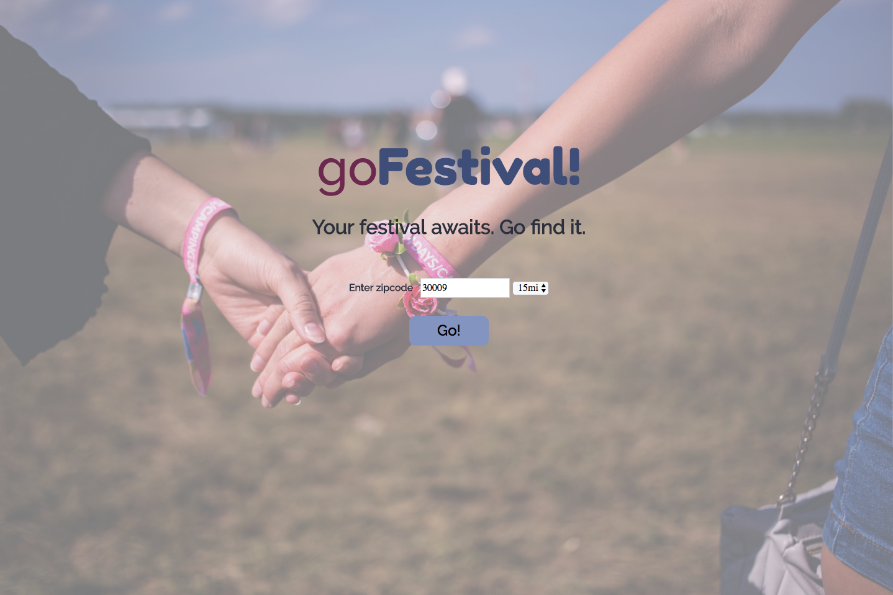
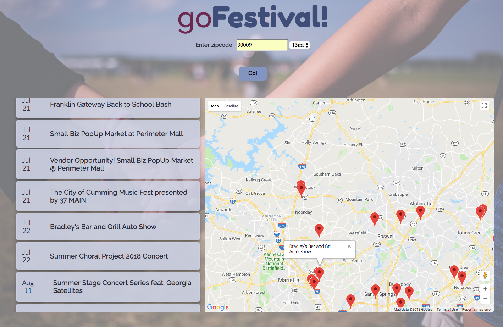
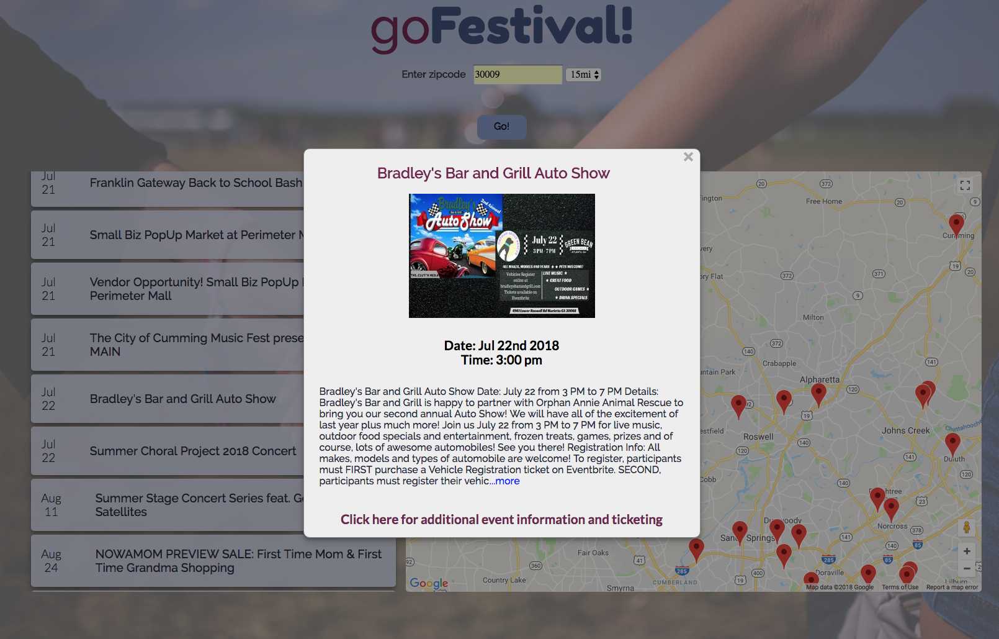
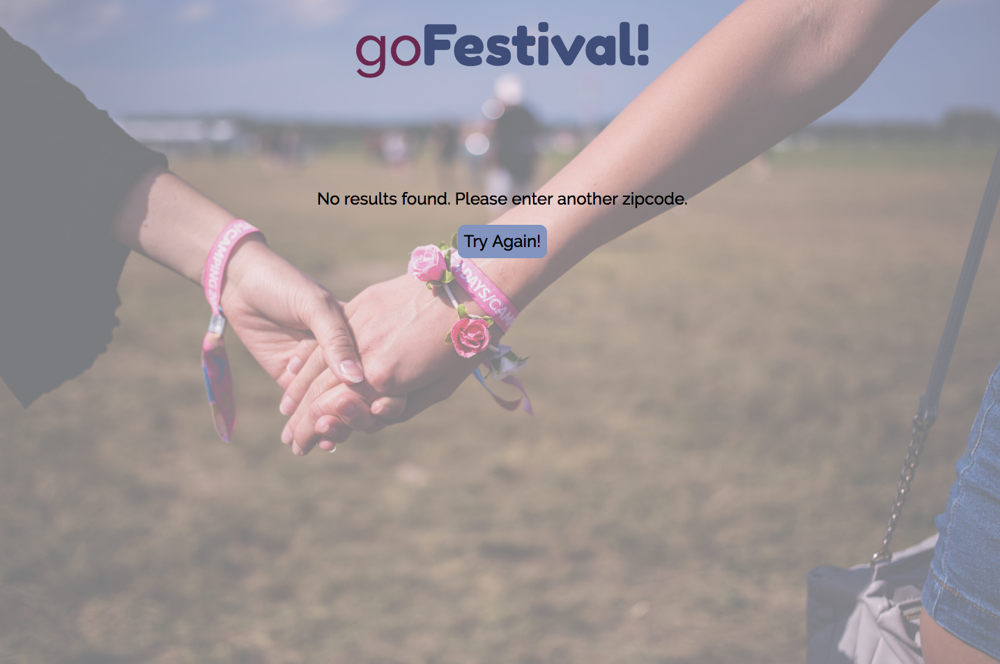

# goFestival!
An application that allows users to enter a zipcode and receive a list of festivals within a specified radius. The application returns a list of festivals along with a map of each festival's location. Users may click on either the listed festival name or on the map marker to access more information regarding the event. The application is powered by Eventbrite and Google Maps.
## Motivation 
To assist users find festivals events in their community or while traveling.
## Demo
https://eswoodard.github.io/goFestival/
## Screenshots
Landing Page/Search Page:

Results Page:

Informational Modal Box:

Error Page:

## Built With
* HTML5
* CSS3
* JavaScript
* jQuery
## Author
**Elizabeth Woodard**
## Acknowedgements
**Marcian Diamond**, Mentor
